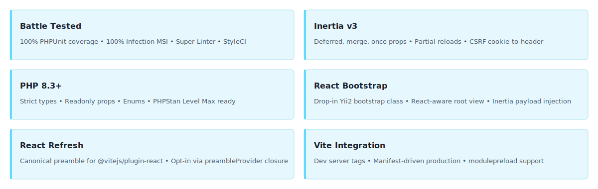

<!-- markdownlint-disable MD041 -->
<p align="center">
    <picture>
        <source media="(prefers-color-scheme: dark)" srcset="https://www.yiiframework.com/image/design/logo/yii3_full_for_dark.svg">
        <source media="(prefers-color-scheme: light)" srcset="https://www.yiiframework.com/image/design/logo/yii3_full_for_light.svg">
        
    </picture>
    <h1 align="center">Inertia React</h1>
    <br>
</p>
<!-- markdownlint-enable MD041 -->

<p align="center">
    <a href="https://github.com/yii2-extensions/inertia-react/actions/workflows/build.yml" target="_blank">
        
    </a>
    <a href="https://dashboard.stryker-mutator.io/reports/github.com/yii2-extensions/inertia-react/main" target="_blank">
        
    </a>
    <a href="https://github.com/yii2-extensions/inertia-react/actions/workflows/static.yml" target="_blank">
        
    </a>
</p>

<p align="center">
    <strong>React adapter helpers for <a href="https://github.com/yii2-extensions/inertia">yii2-extensions/inertia</a></strong><br>
    <em>React-friendly root view and Vite asset integration for Yii2 Inertia applications</em>
</p>

## Features

<picture>
    <source media="(max-width: 767px)" srcset="./docs/svgs/features-mobile.svg">
    
</picture>

## Overview

`yii2-extensions/inertia-react` is a thin PHP-side adapter package for building React-based Inertia applications on top
of `yii2-extensions/inertia`.

This package does not install npm dependencies for you. Instead, it provides.

- a React-specific bootstrap class for Yii2;
- a default root view that outputs Vite tags plus the initial Inertia page payload;
- a Vite helper component for development-server and manifest-driven production assets;
- React Refresh preamble output for `@vitejs/plugin-react` in development mode;
- documentation and conventions for the application-owned React client entrypoint.

## Installation

```bash
composer require yii2-extensions/inertia-react:^0.1
```

Register the React bootstrap class.

```php
return [
    'bootstrap' => [
        \yii\inertia\react\Bootstrap::class,
    ],
    'components' => [
        'inertiaReact' => [
            'class' => \yii\inertia\Vite::class,
            'baseUrl' => '@web/build',
            'devMode' => YII_ENV_DEV,
            'devServerUrl' => 'http://localhost:5173',
            'entrypoints' => [
                'resources/js/app.jsx',
            ],
            'manifestPath' => '@webroot/build/.vite/manifest.json',
            'preambleProvider' => \yii\inertia\react\Bootstrap::reactRefreshPreambleProvider(),
        ],
    ],
];
```

Use only `yii\inertia\react\Bootstrap::class` in the bootstrap list. It already delegates the base
`yii2-extensions/inertia` bootstrap.

## React client entrypoint

Install the client-side dependencies in your application project.

```bash
npm install react react-dom @vitejs/plugin-react @inertiajs/react vite
```

Then create your client entrypoint, for example `resources/js/app.jsx`:

```jsx
import { createInertiaApp } from "@inertiajs/react";
import { createElement } from "react";
import { createRoot } from "react-dom/client";

createInertiaApp({
  resolve: (name) => {
    const pages = import.meta.glob("./Pages/**/*.jsx", { eager: true });
    return pages[`./Pages/${name}.jsx`];
  },
  setup({ el, App, props }) {
    createRoot(el).render(createElement(App, props));
  },
});
```

## Development mode and React Refresh

When `devMode` is `true` and `preambleProvider` is set to `\yii\inertia\react\Bootstrap::reactRefreshPreambleProvider()`,
the Vite helper bypasses the production manifest and emits, in order: the React Refresh preamble, `@vite/client`,
and each `entrypoints` script pointing at `devServerUrl`. Edits to `.jsx` files hot-reload without a full page refresh.

Run the Vite dev server and the Yii2 application side by side:

```bash
# Terminal 1 — Vite dev server
npm run dev

# Terminal 2 — Yii2 in dev mode
YII_ENV=dev ./yii serve
```

See [Development Notes](docs/development.md) for the full HMR workflow, CORS notes, and troubleshooting.

## Production asset integration

This package expects a Vite manifest file generated with `build.manifest = true`. In production it will render.

1. style sheet tags for the entrypoint chunk and its imported chunks;
2. module entry scripts for each entrypoint;
3. optional `modulepreload` tags for imported JavaScript chunks.

## Documentation

For detailed configuration options and advanced usage.

- 📚 [Installation Guide](docs/installation.md)
- ⚙️ [Configuration Reference](docs/configuration.md)
- 💡 [Usage Examples](docs/examples.md)
- 🧪 [Testing Guide](docs/testing.md)
- 🛠️ [Development Notes](docs/development.md)

## Package information

[](https://www.php.net/releases/8.3/en.php)
[](https://github.com/yiisoft/yii2/tree/22.0)
[](https://packagist.org/packages/yii2-extensions/inertia-react)
[](https://packagist.org/packages/yii2-extensions/inertia-react)

## Quality code

[](https://codecov.io/github/yii2-extensions/inertia-react)
[](https://github.com/yii2-extensions/inertia-react/actions/workflows/static.yml)
[](https://github.com/yii2-extensions/inertia-react/actions/workflows/linter.yml)
[](https://github.styleci.io/repos/1203882767?branch=main)

## License

[](LICENSE)
